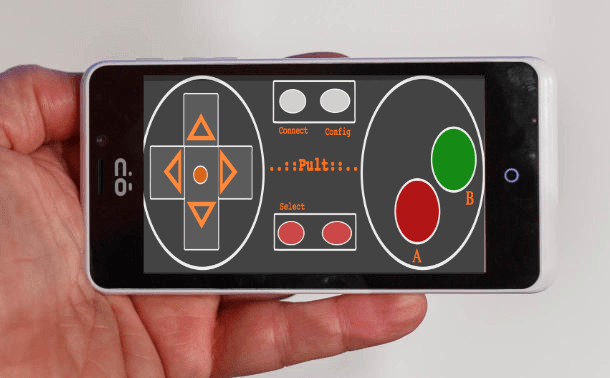

# Pult

Pult ( *i.e "remote controller" in estonian* ) is *HTML5* app that turns any device with modern web browser into a game controller.

It's designed for FirefoxOS phones with touchscreens, but it works also on a desktop or on the RaspberryPI with keyboard.

**Motivation**

I love retrogames and a laptop is not the most comfortable gaming device when a game is streamed onto a bigger screen.

8bit games look much better on 27" screen or on a projector - pixels are bigger. So i built this app to get away from a laptop, play on a couch without being tangled into wires.

**How it can help you?**

`Pult` gives you opportunity to control old DOS or Nintendo games running on openEMU without buying extra hardware or being attached to a computer.

Being wireless gives you longer range than your average USB remote controller and with WIFI it reaches even further than your Wii or EggsBox controller. 

Few things that make `pult` unique:

* it runs on a mobile & a desktop
* can share game without swapping remotes
  (*for example a parent can help her kids out from darkest corner of Dungeons&Dragons*)
* free as speech

## Usage

Using the app should be as simple as following:

 * FirefoxOS owner can install it from app-store, or from `pult-server` or installing manually with Firefox webIDE. Users of other mobileOS or desktop should open `pult-server` url with Firefox browser and follow instructions from there.
 
 * check does a correct keymapping in an app configuration is activate. *If there's no keymappings yet, then click "+" button on the right-top corner, it will show a mappings editor with a default configuration*.
  	
 * activate your WIFI
 * connect to `pult-server` by using its public IP.

[`Pult-server`](https://github.com/tauho/pult-server) is web-server (written in Clojure) that listen incoming messages from pult-app and turns them into native keyboard actions.

## Contributing

Pult is currently in alpha stage:

 * full of technical debts - will be solved in the next release `0.2`
 * a lag is bigger than it should be - planned for `0.2`
 * design is made by programmer - will be solved in `?`
 * no localization yet
 * better & more comprehensive documentation will be added after beta release;

It's my personal fun project and i made code publicly available so you can also learn more about Clojurescript and maybe fix some bugs, open tickets - it's much more effective than trolling on app-store;

The sourcecode is available on github [https://github.com/tauho/pult](https://github.com/tauho/pult). 

#### Basic contribution workflow

* open issue or send message on Gitter
* Let's discuss about it.
* Forked it.
* Make changes on new branch;
* Dont forget to add tests.
* Make pull request.